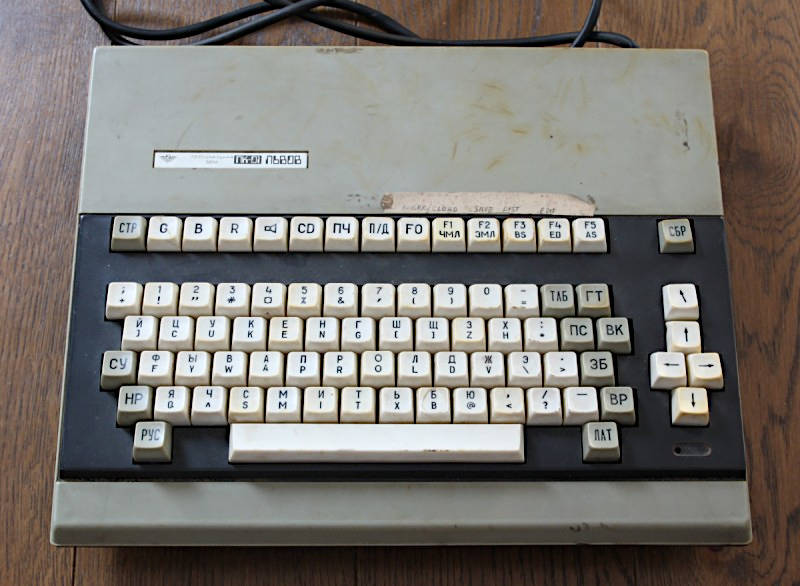

# ПК-01 Львoв

This repository contains all the documentation and notes about ПК-01 Львoв personal computer - probably the ugliest computer I've ever ~~attempted to repair~~ repaired :)

Judge yourself:

Inside this repository:

* [original](orig) documentation collected from the Internet
* mainboard [schematics](sch)  redrawn into (hopefully) more readable form (KiCAD project + [PDFs](sch/pdf))
* some [datasheets](datasheets) of the chips used
* [ROM](roms) files, both from the Internet, as well as dumped from the desoldered EPROMs
* various notes and [docs](docs), including my design analysis  (look there for details)

