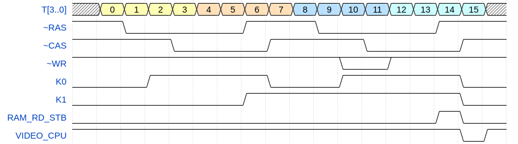

# Memories

## ROM

* 8 chips, 2716 equivalent
* `D5A` flip-flop is responsible for ROM remapping
  * at reset,  `~Q` of `D5A` is low, thus `~ROM_OE` is always low and ROM is effectively mapped 4 times in the CPU address space
  * when CPU writes any I/O port for the first time,  `~Q` goes high, and ROM is mapped into last 16 KB of CPU address space (`0xC000..0xFFFF`)
* this mapping trick is necessary for the CPU to boot from ROM at address 0, the code then perform dummy I/O write to map ROM into its target location 

## RAM

* 8 chips, 4164 DRAM equivalent, one per bit, 64kB total.
* memory refreshing done while generating video.
* RAM output data bus `RD[7..0]` is separated from CPU data bus `D[7..0]` by 8282 latch (`D27`). Latch is strobed by `RAM_RD_STB` signal from RAM controller (see below), output enable is active for every memory read that is not EPROM read (`ROM_OE == 0 && ~MEMR == 0`).
* Quad 74153 multiplexers select row / column address and address source (CPU or timing counters for video output).

### Addressing 

* for video generator access:
  * 2 MSB bits are set to 1, bits `13..0` are formed from `T[18..11]`,  `T[9..4]`
  * video is thus generated from 256 x 64 bytes = 16 kB, 4 pixels each, located at `0xC000..0xFFFF` in the CPU address space
* for CPU access `A[14..0]` signals are used as is, while most significant bit is combined with `~PC1` 
  * if `PC1 == 1`, the `A[15]` is used as MSB
  * if `PC1 == 0`, MSB is forced to 1, effectively higher 32kB of RAM are mapped twice in the CPU address space

This mapping is necessary to manipulate video buffer from ROM code, as ROM is also mapped to the last 16 kB of address space. This mapping is explained as follows in the programmer's manual:

> In normal mode, the on-screen RAM is disconnected from the MP buses and cannot be accessed by software. For the MP to work with this RAM area, it can be connected instead of the main RAM section at addresses 4000H-7FFFH ( 16384-32767 ) using bit 1 of the C2H port ( 194 ) ( 0 - Open Video RAM, 1 - Close Video RAM ). However, it should be remembered that with such a switch, the main RAM area 0000H-7FFFH ( 00000-32767 ) is disconnected from the MP buses, so procedures that work with open video memory cannot be placed below 8000H ( 32768 ). All the main ROM routines that work with the screen "do not forget" to close the video memory before returning and there is no such problem with them.

## RAM controller

RAM controller is responsible for generating all RAM-related signals - `~RAS`, `~CAS`, `~WE`, etc.

* controller is driven by `T[3..0]` signals from timing counter, i.e. the whole sequence (let's call it *RAM cycle*) takes 16 periods of 20 MHz `OSC` clock.
  * it is further divided into *video RAM cycle* (cycles 0 - 7), when video controller reads next byte from RAM, and *CPU RAM cycle* when CPU can read or write a RAM byte.
  * the *CPU RAM cycle* is optional, it happens only if the CPU actually requested memory access
* signals `K0` and `K1` control RAM address multiplexer:
  * `K0` selects row (when 0) or column (when 1) address
  * `K1` selects source of RAM address - timing/video circuitry (when 0), or CPU (when 1)

Following diagram shows a full RAM cycle.

Note:

* `K1` goes high only if there is actual CPU RAM cycle
  * when `~MEMR` or `~MEMW` goes low, `D42A` flip-flop catches `ROM_OE` state, which is high during EPROM access. Thus, its `~Q` output goes high only at the beginning of the RAM read or write cycle;
  * at the beginning of period 6, this state is copied to `D42B`, thus `K1` goes high if and only if the CPU requested RAM read/write;
  * `K1` them remains high until a pulse of `VIDEO_CPU` signal (which happens only if `K1` was high)
  * CPU enters wait states until `VIDEO_CPU` pulse signals end of cycle (see CPU block description)
* signals `~WR` only goes low for memory write, obviously
* signal `RAM_RD_STB` is used to control the D27, which latches the byte from RAM data bus `RD[7..0]` and outputs it to CPU data bus `D[7..0]` (data is latched on the falling edge)
* signals `~RAS`, `~CAS` remain inactive (i.e. high) for periods 8..15 when there is no CPU RAM access happening  

* the `D47C` is somewhat peculiar, my understanding: this gate ensures, that there is at least one `VIDEO_CPU` pulse during reset, to make sure CPU doesn't get stuck in wait state. 

