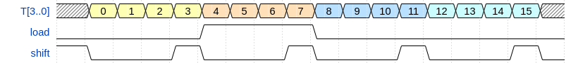

# Video generator

Note:

* all video timing generation is based on `T[..]` signals from timing block
* additionally, `T_RST1` and `T_RST2` signals act as horizontal and vertical blanking, respectively
  * `T_RST1` is low for 256 horizontal pixels, it then goes 1 for 64 pixel times
  * `T_RST2` is low for 256 lines, it then goes high for 64 line periods
* `PB[0..7]` from `PIO` block is used to control color palette (see below)
* data is pulled directly from RAM data outputs - `RD[0..7]` bus

### Synchronization signals generator

Horizontal synchronization pulse (`~CCU`):

* is generated using `D38C` NAND gate (used as inverter) and `D44A` 4-input NAND gate
* pulse is active when `T[7] == 0 && T[6] == 1 && T_RST1 == 1`
* given that `T_RST1` is high for `T[10..4] == 100_xxxx`, sync pulse is high when `T[10..4] == 100_01xx`
* i.e. it goes high for `T[10..4]` in range 68..71, giving 4 cycles / 1.25 MHz = 3.2 μs width pulse

Vertical synchronization pulses (`~KCU`):

* is generated using `D41A` NAND gate (used as inverter) and `D44B` 4-input NAND gate

* pulse is active when `T[9] == 1 && T[15] == 1 && T[16] == 0 && T_RST2 == 1`

* given that `T_RST2` is high for `T[19..11] == 1_00xx_xxxx`, sync pulse is high when `T[19..11] == 1_0001_xxxx`and `T[9] == 1`

  * 16 pulses are generated for equivalent of 16 scan lines - 16 * 1/15625 Hz = 1024 μs 
  * for each scan line period `T[9]` is low for 32 clocks of modulo 80 counter, then high for 32 cycles and low again for 16 cycles. 
  * this gives 32 / 1.25 MHz = 25.6 μs low,  then 25.6 μs high, then 12.8 μs low
  

Horizontal and vertical sync pulses are combined using `D41B`NAND gate.

### Pixel shift register

Parallel load shift register `74198` is used to convert RAM contents into consecutive pixels. Data is loaded from RAM directly (`RD[7..0]`bus), load and shift signals are timed by the `T[3..0]` signals from the timing blocks, using `D33B` , `D37A` and `D37B` gates. 

During a single RAM cycle (see RAM controller description) one byte is loaded from RAM and 4 shift operations are performed - each byte describes 4 pixels, 2 colors per pixel. Byte layout is as follows, where `P<n>.1`and `P<n>.0` denote, respectively, higher and lower color bit of `n-th` pixel in byte:

| 7    | 6    | 5    | 4    | 3    | 2    | 1    | 0    |
| ---- | ---- | ---- | ---- | ---- | ---- | ---- | ---- |
| P0.1 | P1.1 | P2.1 | P3.1 | P0.0 | P1.0 | P2.0 | P3.0 |

### Composite signal generator

Generation of the composite video signal works as follows:

* shift register outputs are converted into 4 brightness levels using `R27` and `R28` resistors
* `D62D` and `D29A` gates are responsible for blanking the output when `T_RST1` or `T_RST2` is high, i.e. during horizontal or vertical retrace, respectively.
* `D61D` and `D29B` gates, together with `R19`, `R20` and `R23` resistors generate proper synchronization levels.

Note: CVBS output is also used as synchronization signal for color monitor.

### RGB signal generation

* 2 color bits from shift register are used as `D56` demux select inputs. 
  * demultiplexer outputs are used to select one of the 4 colors
  * active-low enable inputs of the demultiplexer are controlled by `T_RST1` and `T_RST2` signals, effectively blanking the video when `T_RST1` or `T_RST2` is high
* selected color is  converted into R, G and B signals by combining with `PB[6..0]` signals (effectively limited color palette control)

