# Repair process

Below is my (informal) repair logbook.

## Hardware debugging 

#### 1. Power supply rails

   * all OK

     

#### 2. Clocks at D4 (8224)

   * `Φ1`, `Φ2`, `Φ2TTL` - all OK

     This is how `Φ1`, `Φ2` clocks look like (see the voltages? it's not TTL!) :

     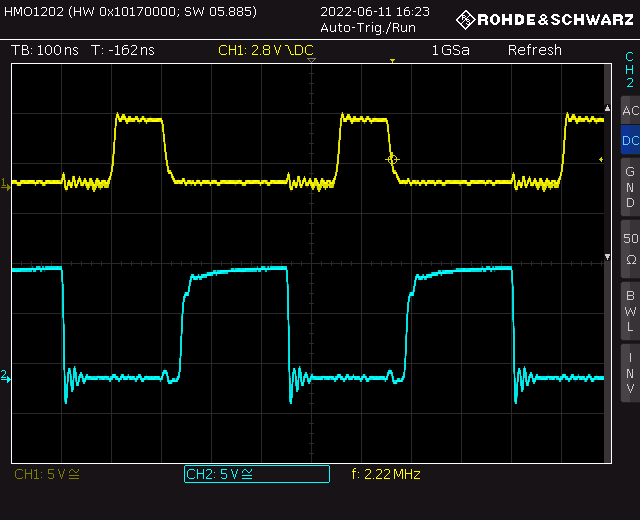

   * `OSC` - 20MHz - OK
     
     At 20 MHz it doesn't look like square wave anymore ;)
     
     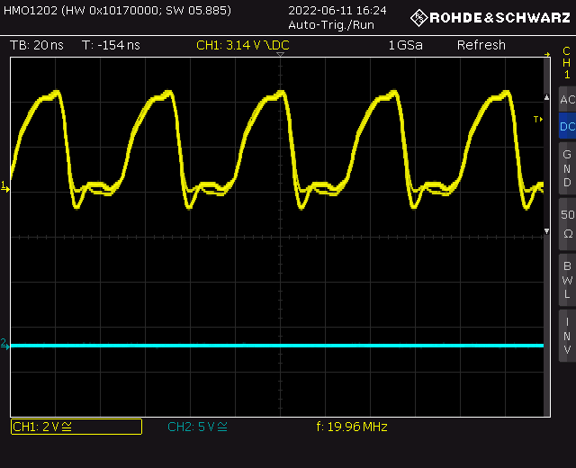
     

   * `RESET` signal - OK

#### 3. STSTB - fault #1 

* I've checked `~MEMR`, `~MEMW`, etc. signals. It looked like the CPU is alive, but one signal looked invalid - `STSTB` (yellow trace):

  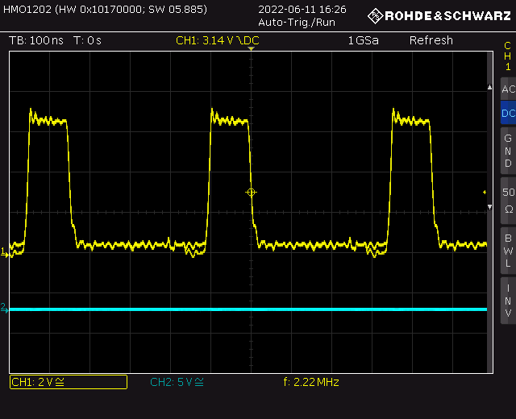

  * Most notably it exceeds 5V. Looking around I've found a short to Φ1 on the PCB. 

  * I guess it's the first time ever I **fix a problem with a toothbrush** :)

* with short removed, `STSTB` signal looked correctly:

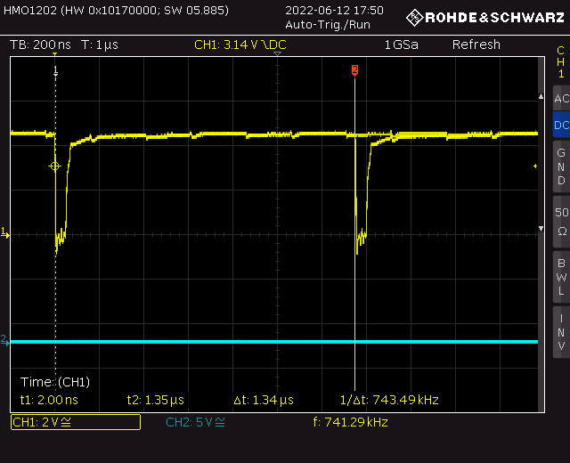

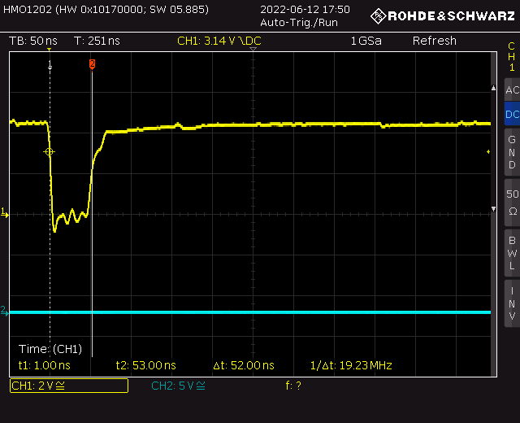

* believe it or not, the problem is inside the red circle :)

  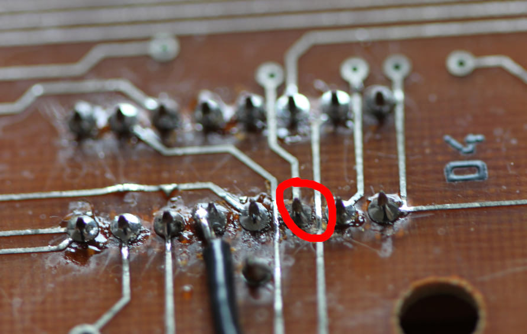

#### 4. Timing block

* `D34` - in @ 20MHz OK, T3 at 1.25Mhz OK

* `mod 80` counting block

  * `T_RST1` is high for 16 cycles, i.e. `16 / 1.25MHz = 12.8μs`- OK

  * full cycle `1.25MHz / 80 = 15 625 Hz` - OK

  * below `A` (i.e. `T_RST1`) and `~Q` of `D43A`

    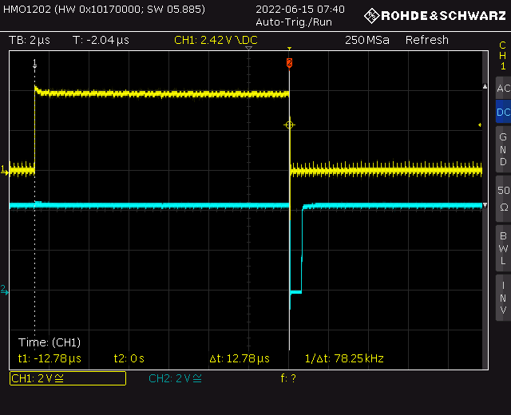

  * below zoomed on  `~Q`output negative pulse:

    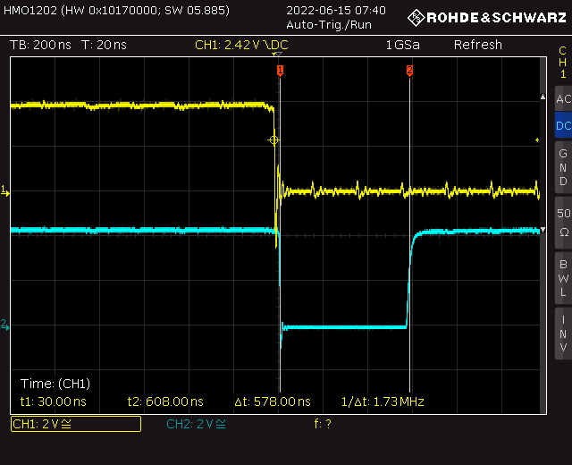

    

* `mod 320` counter

  * full cycle: `15 625 / 320 = 48.82Hz` (this is vertical video sync frequency)

  * `T_RST2` - high for  64 cycles, i.e.  `64 / 15 625 = 4.096ms`

  * below: `A` and `~Q` of `D43B`:

    

    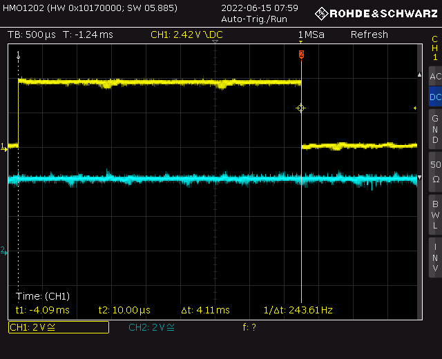

    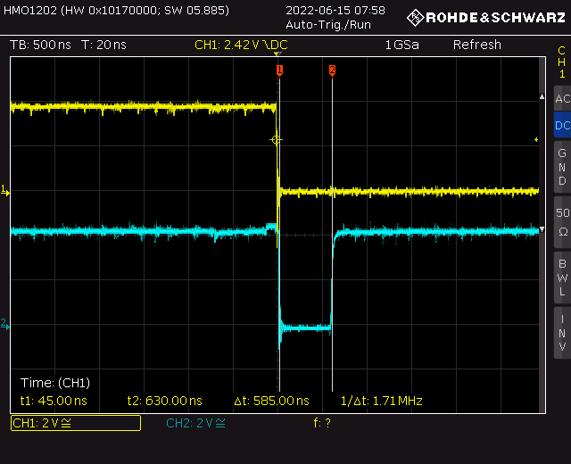

#### 5. RAM controller - fault #2

* given that timing counters are working fine, there should be proper RAM cycles generated (`RAS`, `CAS`, address mux control signals, etc.)

  * nope..

* narrowed to a broken `D49` (`74138`) chip (3 bits to 1-of-8 decoder)

* after replacing `D49` it appeared to work, but I've decided to leave it as is and move on to other blocks, assuming I will get back to RAM later

  * spoiler: all was fine in this block

  

#### 6. Video block

* given that timing generator and RAM controller works, I decided to take a look at video block

* horizontal sync pulses looked as expected:

  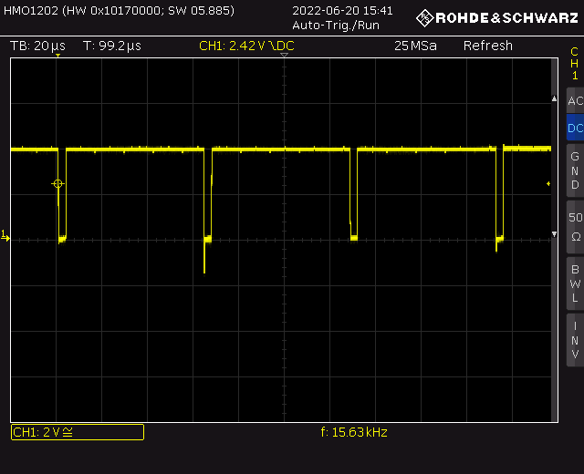

  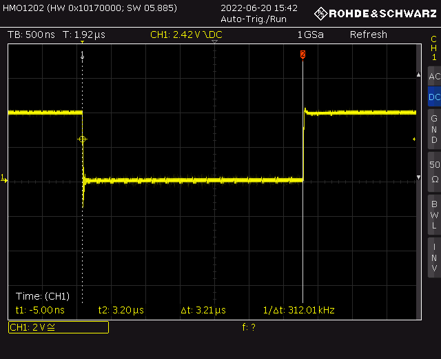

* vertical sync pulses also looked fine:

  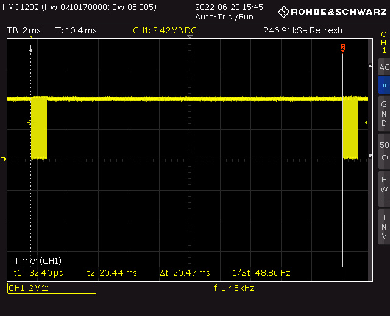
  
  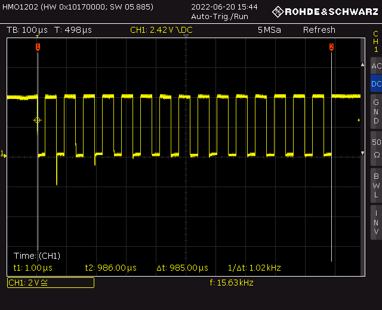
  
  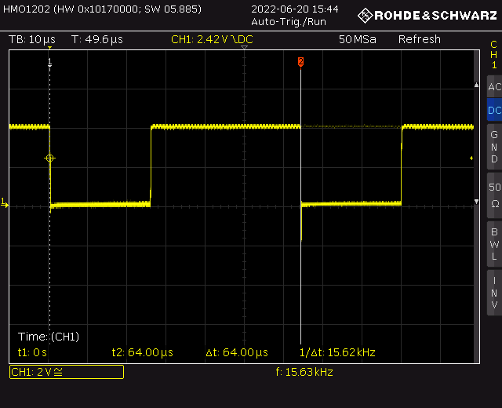
  
  

* I've also checked the pixel shift register (`D55`) input signals:

  * parallel load strobe (blue one, yellow is timing signal for reference):

    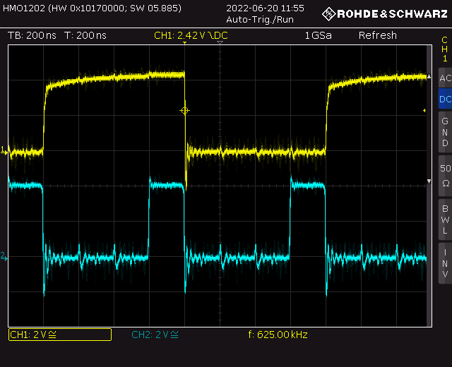

    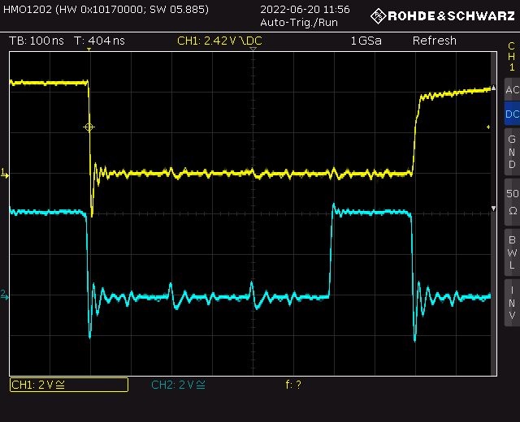

  * pixel shift clock
  
    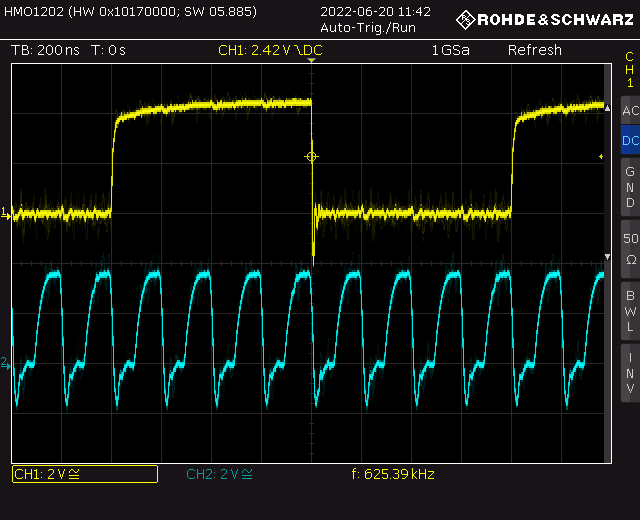
  
    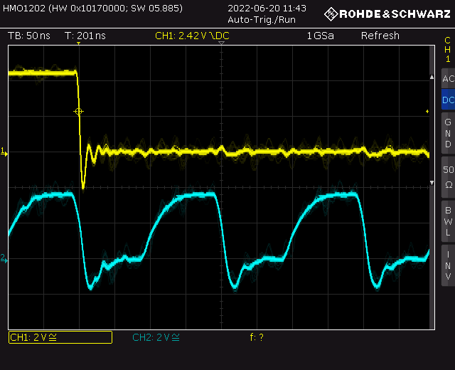

* all perfectly fine, with load triggered every 4 pixels (there are 4 pixels per byte, remember?)
* I've also poked with my scope at analog outputs, all were alive, so I decided to hook up a TV 
  * yay! there was some random garbage on the screen, but sync was OK, and video was stable, indicating, that RAM / video circuits were working!

#### 7. EPROMs address decoder - fault #3

* at that point I decided to look closely at the CPU activity - to see if it is actually executing any code at all (with assumption that most likely it does, as I've seen memory and I/O reads/writes before, when poking around for other things).

* what I saw at `D0` line was sort of surprise:

  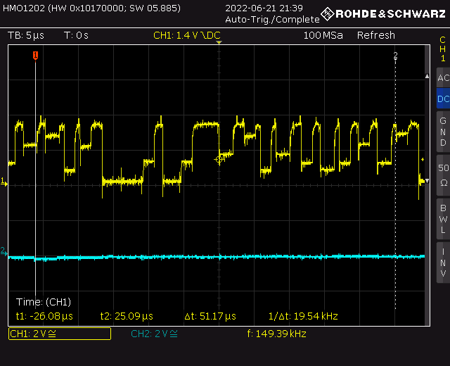

  It doesn't even look like a digital signal at all. The root cause was `D9` 1-of-8 decoder (`74138`), which generates *Chip Enable* signals selecting 1 of 8 EPROMs, depending on the values of the `A11..A13`address lines. This chip was broken with all outputs low - effectively all EPROMs were **driving the data bus at the same time**. What you see above are the EPROMs fighting :) Replacing the chip solved it.

## Software tests

As I had no more ideas about simple tests I could perform, so I decided to do the following:

* extract all RAM from its sockets
* replace first EPROM with my own test code (unfortunately, only the first EPROM was socketed)
* try to run some absolute minimum code to see if the CPU is actually alive and sane

Note:

* I've used https://github.com/Megatokio/zasm assembler, which has a great feature - 8080 mode with Z80 mnemonics. Z80 syntax is much more familiar to me.
* I've used 2732 EPROMs, I have no spare 2716- it's fine, you only need to program same data twice. The MSB address line of 2732 is connected to 5V const.

That's how we get to...

#### Test #1: output 0xAA / 0x55 pattern via 8255 port A

* this test basically outputs `55/AA` pattern on the on-bard 8255 port A, which is easily accessible via `X2` connector. 

  * source code: [01_hello_pio.asm](../tests/01_hello_pio.asm)

  * remember: no RAM, so no variables, no stack (and thus no jump-to-subroutine)

* I've poked around with my logic analyzer (16 channel) - address bus, data bus, `MEMR`, etc.

* to my surprise,  there were perfectly repeatable EPROM read errors - occasional flips od `D0` from `0` to `1`, leading to wrong code executing 

* on the diagram below, yellow trace is `MEMR`, blue one is `D0` - as you can see at the rising edge of the 3rd read, `D0` slowly goes from 0 to 1, while it should remain 0 for the `MEMR` pulse duration.

  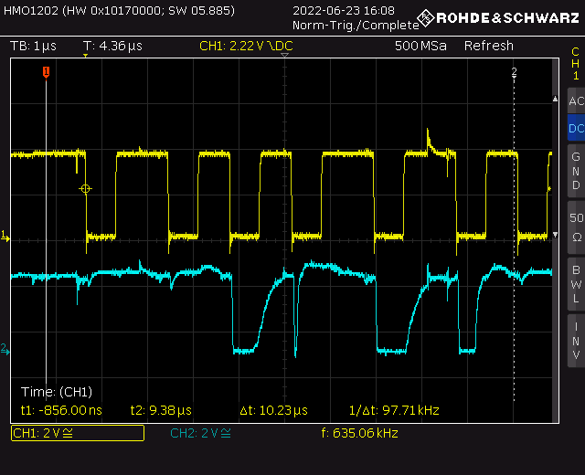

  * I've decided to eliminate potential `D0` drivers, by cutting `D0` trace / wire leading to both `8255` chips - no change

  * at that point I suspected `D8` (`8228`) being broken (spoiler: I was wrong here)

  * I've decided to desolder all the EPROMs (I suspected a borken EPROM can mess with `D0`), but **nothing changed**, which was sort of puzzling 

  * I've replaced my test EPROM with another one and... everything worked! Which leads to **epic fail story**:

    * my EPROM, Nec `μPD2732`, was OK, but not programmed properly - it requires much longer `Vpp` pulse (`50ms`), than the default I used
    * **lesson #1:** even if verification done right after programming passes OK, it doesn't mean that the EPROM will behave as expected in real application!
    * **lesson #2**: always check your EPROM's datasheet

  * after re-programming the test worked as expected! 

    * so we have **working CPU** and **ability to output bytes to outside world** - that's a great milestone

    

#### Test 2: dump EPROM contents via 8255 port A - fault #4

* this test basically outputs all the EPROM address space via port A, using `PB2` as strobe signal
  * source code: [02_dump_roms.asm](../tests/02_dump_roms.asm)

* the data can the be grabbed with logic analyzer and compared with expectations (of course one of 8 EPROMs is replaced with my own test code)
  * I've used [DSLogic](https://sigrok.org/wiki/DreamSourceLab_DSLogic) + [PulseView](https://sigrok.org/wiki/PulseView) + [parallel decoder](https://sigrok.org/wiki/Protocol_decoder:Parallel) to grab the data
* so, after soldering the sockets and putting the EPROMs back, I've detected one broken chip, confirmed with EPROM programmer

#### Test 3: test RAM memory

* everything before was done without using RAM - no variables, no call stack
* how can we test RAM without using any variables, relying on CPU registers only?
  * [Linear-feedback shift register](https://en.wikipedia.org/wiki/Linear-feedback_shift_register) to the rescue
  * we can easily implement table-driven LFSR using only registers and 512-bytes const table
  * we can then fill all 64kB of RAM with LFSR-generated pseud-random sequence, then dump it via port A (as in case of EPROM tests), and compare with the same sequence generated on the PC (it is pseudo-random - which means it's perfectly deterministic, the same every time you run the LFSR generator).
  * table was generated using [pycrc](https://pycrc.org/)
  * [03_test_ram.asm](../tests/03_test_ram.asm) is the code fills all the RAM using LFSR, and dumps it back via port A
  * the [lfsr16.py](../test/gen/lfsr16.py) script generates reference [pattern](../test/gen/pattern) to compare against 
* data grabbed via logic analyzer + sigrok compared perfectly! RAM is fine!

#### Test 4: video output

* CPU, ROM and RAM OK - why not try to display something?
* [04_video.asm](../tests/04_video.asm) displays simple slanted bars, with all 4 colors repeating 
* it passed!

## Summary

At this point I decided to put back original EPROM - and Basic prompt appeared! Mission accomplished.

To summarize the faults:

* one short on the PCB (`STSTB` and clock signal)

* 2 broken `74138` chips (one in RAM timing block, one in EPROM chip selection circuitry) 

* one broken EPROM

  
