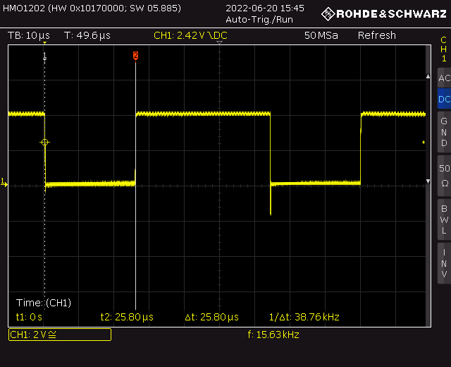

# Repair process

Below is my (informal) repair logbook.

## Hardware debugging 

#### 1. Power supply rails

   * all OK

     

#### 2. Clocks at D4 (8224)

   * `Φ1`, `Φ2`, `Φ2TTL` - all OK

     This is how `Φ1`, `Φ2` clocks look like (see the voltages? it's not TTL!) :

     

   * `OSC` - 20MHz - OK
     
     At 20 MHz it doesn't look like square wave anymore ;)
     
     
     

   * `RESET` signal - OK

#### 3. STSTB - fault #1 

* I've checked `~MEMR`, `~MEMW`, etc. signals. It looked like the CPU is alive, but one signal looked invalid - `STSTB` (yellow trace):

  

  * Most notably it exceeds 5V. Looking around I've found a short to Φ1 on the PCB. 

  * I guess it's the first time ever I **fix a problem with a toothbrush** :)

* with short removed, `STSTB` signal looked correctly:

* believe it or not, the problem is inside the red circle :)

  

#### 4. Timing block

* `D34` - in @ 20MHz OK, T3 at 1.25Mhz OK

* `mod 80` counting block

  * `T_RST1` is high for 16 cycles, i.e. `16 / 1.25MHz = 12.8μs`- OK

  * full cycle `1.25MHz / 80 = 15 625 Hz` - OK

  * below `A` (i.e. `T_RST1`) and `~Q` of `D43A`

    

  * below zoomed on  `~Q`output negative pulse:

    

    

* `mod 320` counter

  * full cycle: `15 625 / 320 = 48.82Hz` (this is vertical video sync frequency)

  * `T_RST2` - high for  64 cycles, i.e.  `64 / 15 625 = 4.096ms`

  * below: `A` and `~Q` of `D43B`:

    

    

    

#### 5. RAM controller - fault #2

* given that timing counters are working fine, there should be proper RAM cycles generated (`RAS`, `CAS`, address mux control signals, etc.)

  * nope..

* narrowed to a broken `D49` (`74138`) chip (3 bits to 1-of-8 decoder)

* after replacing `D49` it appeared to work, but I've decided to leave it as is and move on to other blocks, assuming I will get back to RAM later

  * spoiler: all was fine in this block

  

#### 6. Video block

* given that timing generator and RAM controller works, I decided to take a look at video block

* horizontal sync pulses looked as expected:

  

  

* vertical sync pulses also looked fine:

  
  
  
  
  
  
  

* I've also checked the pixel shift register (`D55`) input signals:

  * parallel load strobe (blue one, yellow is timing signal for reference):

    

    

  * pixel shift clock
  
    
  
    

* all perfectly fine, with load triggered every 4 pixels (there are 4 pixels per byte, remember?)
* I've also poked with my scope at analog outputs, all were alive, so I decided to hook up a TV 
  * yay! there was some random garbage on the screen, but sync was OK, and video was stable, indicating, that RAM / video circuits were working!

## Software tests

At that point I had no more ideas about simple tests I could perform, so I decided to do the following:

* extract all RAM from its sockets
* replace first EPROM with my own test code (unfortunately, only the first EPROM was socketed)
* try to run some absolute minimum code to see if the CPU is actually alive and sane

Note:

* I've used https://github.com/Megatokio/zasm assembler, which has a great feature - 8080 mode with Z80 mnemonics. Z80 syntax is much more familiar to me.
* I've used 2732 EPROMs, I have no spare 2716- it's fine, you only need to program same data twice. The MSB address line of 2732 is connected to 5V const.

That's how we get to...

#### Test #1: output 0xAA / 0x55 pattern via 82C55 port A

* source code: [01_hello_pio.asm](../tests/01_hello_pio.asm)

* remember: no RAM, so no variables, no stack (and thus no jump-to-subroutine)
* I've poked around with my logic analyzer (16 channel) - address bus, data bus, `MEMR`, etc.

* to my surprise,  there were perfectly repeatable EPROM read errors - occasional flips od `D0` from `0` to `1`

  

